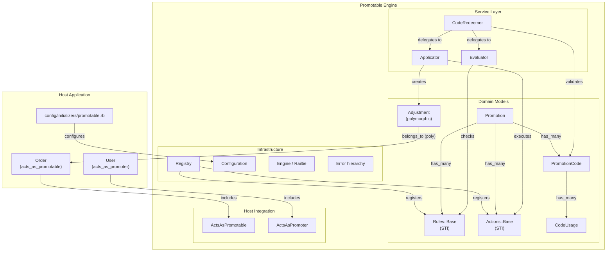
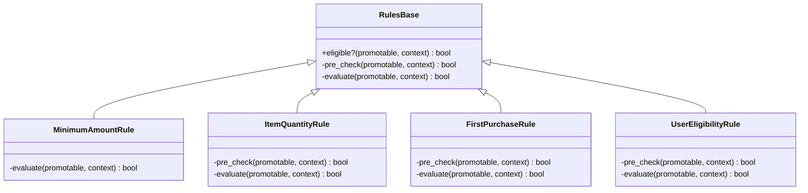
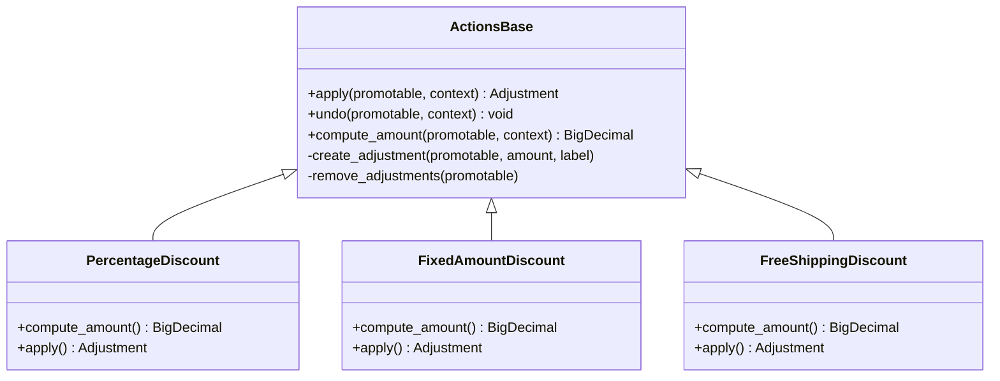
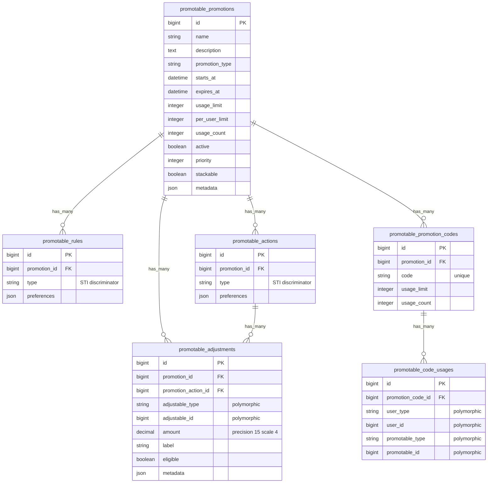
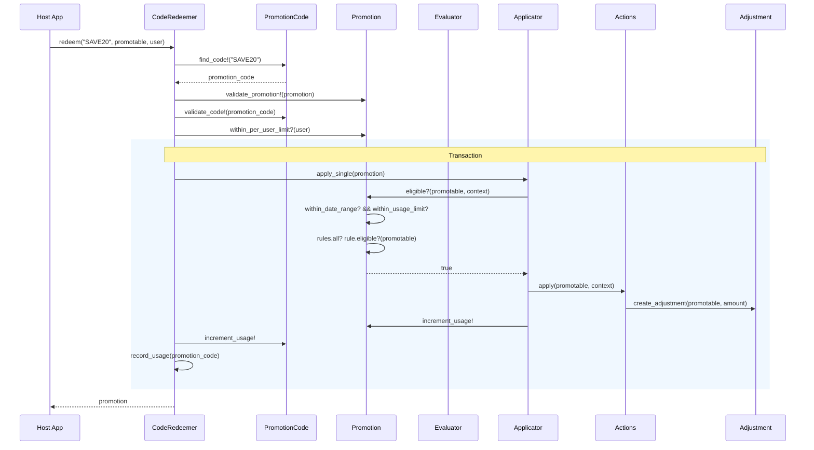
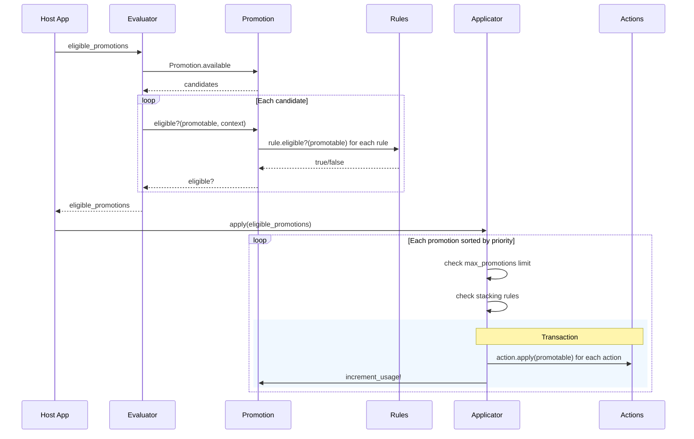

# Promotable -- Architecture

This document describes the internal architecture, design patterns, data model, and extension points of the Promotable engine.

## System Overview



## Design Patterns

### 1. Strategy Pattern (via Single Table Inheritance)

Rules and Actions each use STI with a shared `type` column. Every subclass implements a fixed contract, making them interchangeable at runtime without any conditional logic in the calling code.





**Why STI?** Each rule/action row lives in one table (`promotable_rules` or `promotable_actions`) with a `type` column that Rails resolves to the correct class. This means a `Promotion` can `has_many :rules` and iterate over them uniformly -- each one responds to `#eligible?` but with completely different logic inside.

### 2. Template Method

Base classes define a skeleton algorithm with hook methods. Subclasses override only the hooks they need.

**`Rules::Base#eligible?`** executes two steps in order:

```
eligible?(promotable, context)
  |
  +-- pre_check(promotable, context)   # fast-fail guard (hook, defaults to true)
  |     |
  |     +-- return false if fails
  |
  +-- evaluate(promotable, context)    # actual logic (abstract, subclasses MUST override)
```

- `pre_check` -- optional hook for fast-fail guards (e.g. "is there a user in context?"). Defaults to `true`.
- `evaluate` -- the real eligibility logic. Raises `NotImplementedError` if not overridden.

This lets rules like `FirstPurchaseRule` reject immediately if no user is present (via `pre_check`) without touching the database at all.

### 3. Registry Pattern

A thread-safe registry (backed by `Concurrent::Map`) lets host apps register custom rule and action classes at boot time. The engine never needs to know about custom types -- they are discovered through the registry.

```
Promotable.configure do |config|
  config.rule_registry     -->  Registry<Rules::Base>
  config.action_registry   -->  Registry<Actions::Base>
end
```

Registry enforces that every registered class is a subclass of the expected base:

```ruby
registry.register(:loyalty, LoyaltyRule)  # OK if LoyaltyRule < Rules::Base
registry.register(:bad, String)           # raises ArgumentError
```

## Data Model

### Entity-Relationship Diagram



### Key design decisions

| Decision | Rationale |
|---|---|
| `json` columns for preferences/metadata | Portable across PostgreSQL, MySQL, and SQLite. Accessed via `store_accessor`. |
| Polymorphic `adjustable` on adjustments | Any model can receive discounts -- orders, carts, subscriptions, etc. |
| Polymorphic `user` on code_usages | Any authentication model works (User, Admin, Account). |
| `type` column on rules and actions | STI discriminator -- Rails auto-resolves to the correct subclass. |
| `stackable` + `priority` on promotions | Controls whether promotions combine and in what order they apply. |
| Separate `PromotionCode` model | A single promotion can have many codes (batch-generated coupon campaigns). |
| `usage_count` as counter (not computed) | Avoids expensive COUNT queries on every eligibility check. Incremented transactionally. |

## Service Layer

Three service objects orchestrate the promotion lifecycle. They are stateless and instantiated per-request.

### Request Flow: Code Redemption



### Request Flow: Auto-Apply Best Promotions



### Service Responsibilities

| Service | Role | Key methods |
|---|---|---|
| `Evaluator` | Determines which promotions are eligible for a given promotable. Resolves candidates either from all available promotions or from a specific code. | `eligible_promotions`, `best_promotion` |
| `Applicator` | Applies or removes promotion actions. Enforces stacking rules and max-promotion limits. Wraps action execution in a transaction. | `apply`, `apply_single`, `remove`, `remove_all` |
| `CodeRedeemer` | End-to-end coupon redemption. Validates the code, promotion status, usage limits, and per-user limits, then delegates to Applicator. | `redeem` |

## Host App Integration

Two concerns are auto-included into `ActiveRecord::Base` via the engine's `ActiveSupport.on_load(:active_record)` hook. Host models opt in by calling the class macro.

### ActsAsPromotable

Called on any model that can *receive* discounts:

```ruby
class Order < ApplicationRecord
  acts_as_promotable
end
```

This adds:
- `has_many :promotable_adjustments` (polymorphic)
- `has_many :promotable_code_usages` (polymorphic)
- Instance methods: `apply_promotion_code`, `apply_best_promotions`, `remove_all_promotions`, `recalculate_promotions`, `promotion_total_discount`, `active_promotions`

**Interface contract** -- the host model must implement:

| Method | Returns | Used by |
|---|---|---|
| `#promotable_amount` | `BigDecimal` | All rules and actions |
| `#promotable_items` | Array-like | `ItemQuantityRule` (optional) |
| `#promotable_shipping_cost` | `BigDecimal` | `FreeShippingDiscount` (optional) |

### ActsAsPromoter

Called on any model that *uses* promotions:

```ruby
class User < ApplicationRecord
  acts_as_promoter
end
```

This adds:
- `has_many :promotion_code_usages` (polymorphic)
- Instance methods: `promotion_usage_count`, `used_promotion?`, `available_promotions`

## Extension Points

The system is designed around the Open/Closed Principle -- new behavior is added by creating new classes, never by modifying existing ones.

| Extension point | How to extend | Registration |
|---|---|---|
| New eligibility rule | Subclass `Promotable::Rules::Base`, implement `#evaluate` | `config.rule_registry.register(:key, MyRule)` |
| New discount action | Subclass `Promotable::Actions::Base`, implement `#compute_amount` and `#apply` | `config.action_registry.register(:key, MyAction)` |
| New promotable model | Call `acts_as_promotable`, implement `#promotable_amount` | None needed |
| New promoter model | Call `acts_as_promoter` | None needed |
| Configuration | `Promotable.configure { \|c\| ... }` | N/A |

### Extension example: custom rule

```ruby
class GeoLocationRule < Promotable::Rules::Base
  store_accessor :preferences, :allowed_countries

  private

  def pre_check(_promotable, context)
    context[:user]&.respond_to?(:country)
  end

  def evaluate(_promotable, context)
    countries = Array(allowed_countries)
    countries.include?(context[:user].country)
  end
end
```

```ruby
# config/initializers/promotable.rb
Promotable.configure do |config|
  config.rule_registry.register(:geo_location, GeoLocationRule)
end
```

No gem code is modified. The rule is persisted via STI in `promotable_rules` and its configuration stored in the `preferences` JSON column.

## File Structure

```
promotable/
├── app/models/promotable/
│   ├── application_record.rb        # Abstract base for all engine models
│   ├── promotion.rb                 # Core promotion entity
│   ├── promotion_code.rb            # Redeemable coupon codes
│   ├── code_usage.rb                # Polymorphic usage tracking
│   ├── adjustment.rb                # Polymorphic discount records
│   ├── rules/
│   │   ├── base.rb                  # STI base -- #eligible? / #evaluate
│   │   ├── minimum_amount_rule.rb   # promotable_amount >= threshold
│   │   ├── item_quantity_rule.rb    # promotable_items.size >= threshold
│   │   ├── first_purchase_rule.rb   # user has zero prior usages
│   │   └── user_eligibility_rule.rb # user.promotion_group matches
│   └── actions/
│       ├── base.rb                  # STI base -- #apply / #undo / #compute_amount
│       ├── percentage_discount.rb   # X% off promotable_amount
│       ├── fixed_amount_discount.rb # flat $X off (capped)
│       └── free_shipping_discount.rb# negates promotable_shipping_cost
│
├── db/migrate/
│   └── 20260409000001_create_promotable_tables.rb  # All 6 tables
│
├── lib/
│   ├── promotable.rb                # Entry point, configure/reset
│   └── promotable/
│       ├── version.rb               # Gem version
│       ├── engine.rb                # Rails::Engine, Railtie hooks
│       ├── configuration.rb         # Configuration DSL, lazy registries
│       ├── registry.rb              # Thread-safe type registry
│       ├── errors.rb                # Error class hierarchy
│       ├── acts_as_promotable.rb    # Concern for promotable models
│       ├── acts_as_promoter.rb      # Concern for user/promoter models
│       ├── evaluator.rb             # Finds eligible promotions
│       ├── applicator.rb            # Applies/removes promotions
│       └── code_redeemer.rb         # End-to-end coupon redemption
│
├── lib/generators/promotable/
│   ├── install/                     # rails g promotable:install
│   ├── rule/                        # rails g promotable:rule NAME
│   └── action/                      # rails g promotable:action NAME
│
└── lib/tasks/
    └── promotable_tasks.rake        # rake promotable:stats
```

## Error Hierarchy

All errors descend from `Promotable::Error` for catch-all rescue:

```
Promotable::Error
├── InvalidCodeError            # code string not found
├── IneligibleError             # promotion fails eligibility
├── PromotionInactiveError      # active flag is false
├── PromotionExpiredError       # outside date range
├── UsageLimitExceededError     # code, promotion, or per-user limit
├── StackingNotAllowedError     # stacking disabled, already has a promo
├── MaxPromotionsExceededError  # max_promotions_per_promotable reached
└── PromotableInterfaceError    # model missing required method
```
